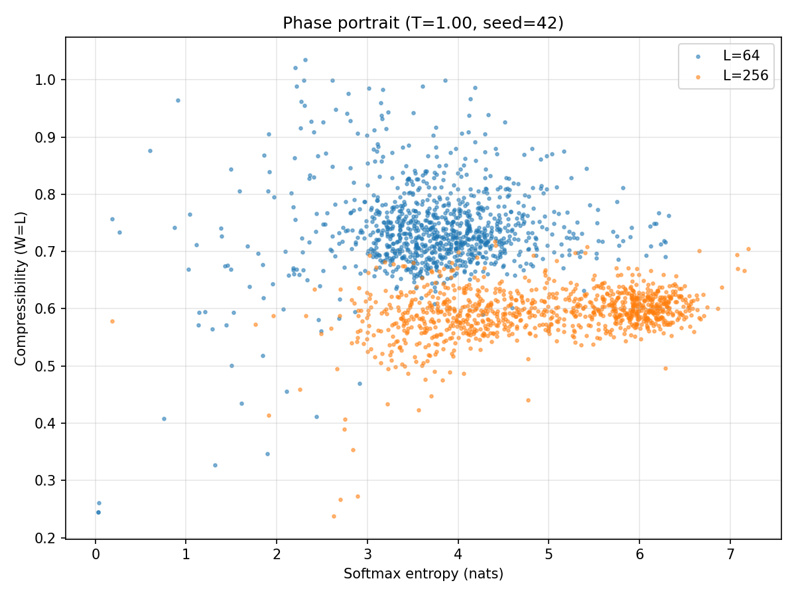

# autoloop

Basin topography and learnable steering in autoregressive generation.

A small language model (SmolLM-135M) generates tokens indefinitely into a fixed-length sliding context window, conditioning entirely on its own output. The resulting system is a discrete stochastic dynamical system with surprisingly rich structure: attractor basins, phase transitions, escape dynamics, and semantic eigenstates. This project maps the basin landscape, builds closed-loop controllers that navigate it, and works toward learned steering across the full topology.

> **Status:** Active research. Phase 0 (landscape mapping) and Phase 1 (closed-loop control) complete. Currently building basin cartography infrastructure. Not taking contributions, but forks and discussion are welcome.

## What we're finding

**Four regimes** emerge across temperature (T) and context length (L): repetitive collapse, suppressed dynamics (structure but slow mixing), rich dynamics, and incoherent noise. The boundary between collapse and escape is sharp and L-dependent.

**The escape boundary T_escape(L) saturates.** L=64 escapes at T~0.55, L=192 at T~0.67, L=256 at T~0.87, L=512 at T~0.90. The steep rise from L=128 to L=256 flattens out -- above L~256, context is "sufficient" and temperature alone determines the regime.

**Collapse is a staircase of attractor basins.** At T=0.50, each L settles onto a distinct entropy floor. L=256 hits zero entropy by 15k steps. L=128 sits on a meta-stable false floor for 45k steps before dropping. L=64 stays on a higher basin for the full 100k-step run. Collapse is a timescale phenomenon -- L sets how fast you descend through a hierarchy of basins.


**Attractor content describes its own dynamics.** Across 21 collapsed runs, every attractor features tautologies, incomplete predicates, self-perpetuating conditions, and confinement. These are eigenstates: configurations where content, structure, and prediction align into zero-gradient fixed points.

**Escape by semantic mutation.** At threshold L, the model doesn't jump out of an attractor -- it tunnels out by mutating it. "Star Wars" becomes "Star Wars 2000" becomes "Star Wars: The Old Republic" becomes freedom. Period-doubling as a route to chaos.

**Basin escape hysteresis.** Exiting an occupied attractor requires ~0.4T more than avoiding it from a cold start. Basin depth depends on mutual information between cycle positions -- multi-token cycles lock harder than single-token repeats.

**Closed-loop control works.** A simple controller (adjust T per segment, adjust L when T saturates) holds Heaps' beta near a target of 0.90 -- a natural equilibrium regardless of L or starting T. Balance T tracks T_escape(L): T=0.70 for L=8, T=0.75 for L=16, T=0.90-0.95 for L=128 and L=256. Small L has a wide stability basin; large L oscillates at the escape boundary.



**Suppressed dynamics is scale-invariant.** A shallow basin at low temperature behaves like a deep basin at moderate temperature. The regime is defined by the ratio of basin depth to thermal energy, not absolute L or T.

**Vocabulary richness cleanly separates regimes.** Type-token ratio spans 100x across conditions. Heaps' law exponent beta separates collapse (0.17), rich dynamics (0.80), and escape events (>1.0).

See [observations.md](observations.md) for the full findings log with reproduction commands.

## Architecture

`autoloop/` package in project root. CLI entry point installed via `uv sync`.

| Module | Purpose |
|--------|---------|
| `autoloop/cli.py` | Unified CLI (`loop`): all subcommands, argparse dispatch |
| `autoloop/resolve.py` | Run resolution: ID lookup and filter queries against SQLite index |
| `autoloop/engine.py` | Token generation engine: `StepEngine` with step, sensors, comp_spectrum, embed_context, snapshot/rollback, checkpoint |
| `autoloop/experiment.py` | Experiment framework: controllers (`Fixed`, `Schedule`, `Beta`), `StateMachine`, universal run loop |
| `autoloop/survey.py` | Basin survey: `SurveyController` (COOLING/CAPTURED/HEATING/TRANSIT), `CentroidCatalogue` for online novelty detection |
| `autoloop/sweep.py` | Sweep runner: named presets, ad-hoc grids |
| `autoloop/runlib.py` | Run discovery, path constants, classification |
| `autoloop/runindex.py` | SQLite index builder and query interface |
| `autoloop/schema.py` | Data schema definitions v2 (runs + basin_types + basin_captures) |
| `autoloop/analyze/` | Analysis package: compressibility, stationarity, summaries; incremental cache |
| `autoloop/plot.py` | Visualization: entropy, compressibility, phase portraits, temporal portraits, violins |
| `autoloop/precollapse.py` | Pre-collapse detection and analysis |
| `autoloop/precollapse_report.py` | Pre-collapse reporting: summary rows, detail reports |
| `autoloop/semantic.py` | Semantic core: data types, loading, theme search, attractor catalog |
| `autoloop/semantic_clouds.py` | Theme discovery, co-occurrence, basin mapping |
| `autoloop/semantic_report.py` | Semantic reporting: theme density, full analysis |
| `autoloop/summary.py` | Cross-condition summary table builder |
| `autoloop/grep_text.py` | Grep for decoded text in parquet runs: regex, context, step/L/T display |
| `autoloop/explorer.py` + `static/` | Interactive web explorer: FastAPI + Plotly.js, buffered context viewer |
| `autoloop/utils.py` | Shared primitives: compressibility, EOS EMA |

## Data

~70 runs across sweeps, controller experiments, annealing, and probes. ~1.1GB total.

- **Sweep runs:** L={64..512} x T={0.50..1.50} x seeds {42, 123, 7}
- **Controller runs:** closed-loop beta-tracking at various (L, T) starting points, including a 1M-step drift run
- **Annealing runs:** tiered cooling/heating experiments
- **Probes:** quick feasibility checks (5k tokens)

Each run produces a Parquet file (per-token entropy, log-probability, EOS flag, decoded text, per-step T and L), a JSON sidecar with full metadata, and an incremental analysis cache. Checkpoints enable resume and extension. Survey runs additionally produce `.basins.pkl` sidecars containing basin captures with 576-dim embeddings.

Data directory is organized into subdirectories by experiment type (`sweep/`, `controller/`, `anneal/`, `probe/`, `survey/`, `schedule/`) with a SQLite index for cross-run queries. Basin data uses three-tier storage: embeddings in `.basins.pkl` per run, type centroids in `data/basins/centroids.npy`, and scalar summaries in SQLite (`basin_types` + `basin_captures` tables). Raw data is not included in the repo. Figures are tracked in `data/figures/`.

## CLI reference

The `loop` command is the unified entry point. Install with `uv sync`, then use directly.

```bash
# Run experiments
loop run fixed --seed 42 -L 64 -T 0.50 --total-steps 100000
loop run schedule --seed 42 --spec "50000:L256:T0.60,50000:L64:T0.80"
loop run beta --seed 42 --start-L 8 --start-T 1.00 --drift --total-steps 1000000

# Basin survey
loop survey --seed 42 -L 8 --total-steps 100000
loop survey --seed 42 -L 64 --T-min 0.50 --T-max 0.80

# Sweeps (named preset or ad-hoc grid)
loop sweep pilot
loop sweep --L 64 128 256 --T 0.50 0.70 1.00 --seed 42
loop sweep --status                        # grid table from index
loop sweep --list                          # list presets

# Run index (SQLite)
loop index build                           # full reindex
loop index query                           # list all runs
loop index query --type sweep --T 0.50     # filtered
loop index query --json                    # JSON output

# Interactive explorer
loop explore                               # starts on port 8000

# Plots (runs resolved by ID or filters)
loop plot L0064_T0.50_S42 L0064_T1.00_S42 --plots entropy phase
loop plot --type sweep --T 0.50 --plots violin

# Analysis and diagnostics
loop analyze --type sweep --L 64           # recompute analysis caches
loop precollapse --detail L0256_T0.80_S42  # basin transition report
loop precollapse --csv data/precollapse.csv
loop summary --out data/summary.csv        # cross-condition summary

# Semantic analysis
loop semantic --clouds                     # auto-discover themes, map basins
loop semantic --themes water book food     # multi-theme density report

# Text search
loop grep "Star Wars" --type sweep --count
loop grep "education" -i --type controller -C 30
loop grep "young|old" --regex --L 64
```

Most subcommands accept run IDs (parquet stems like `L0064_T0.50_S42`) or filter flags (`--type`, `--L`, `--T`, `--seed`, `--regime`). Requires SmolLM-135M weights at `data/model/SmolLM-135M/`.

## Where this is headed

**Phase 0 (complete):** Mapped the T x L landscape. Four regimes identified. T_escape(L) curve measured. Multi-scale compression framework built.

**Phase 1 (complete):** Closed-loop control. BetaController finds beta~0.90 equilibrium. Balance T tracks T_escape(L). Drift mode grows L over time. Sensor framework validated: entropy and Heaps' beta are the right control signals.

**Current work -- basin cartography:** Survey protocol (COOLING -> CAPTURED -> HEATING -> TRANSIT) implemented in `survey.py` as a `StateMachine` experiment. Systematically cools to capture basins, fingerprints them via compression spectra + embeddings, heats to escape, and repeats. Online novelty detection via cosine distance to centroid catalogue. Smoke-tested at L=8; capture detection thresholds being tuned before full L-ladder runs. See [docs/basin-mapping.md](docs/basin-mapping.md).

**Next -- learned controller:** Train a small model on existing controller decision data (~1050 examples). 10D sensor input, 2D output (delta-T, delta-L). Beta-tracking first, then exploration objective once basin survey generates training data.

**Longer term -- semantic topology:** Basin transition paths form a graph of the model's semantic space. Pre-collapse trajectories already show connected descent paths (education -> violence -> apocalypse -> cataloging -> imprisonment -> Star Wars). The full topology -- which basins connect to which, and what the transition costs are -- is a map of the model's behavioral repertoire extracted purely from output dynamics.

## Project documents

- [observations.md](observations.md) -- Findings log with current model summary
- [run-index.md](run-index.md) -- Grid status and phase planning
- [docs/project-brief.md](docs/project-brief.md) -- Full research design
- [docs/basin-mapping.md](docs/basin-mapping.md) -- Basin survey protocol and roadmap
- [docs/interaction-topology.md](docs/interaction-topology.md) -- Speculative framing: generative dynamics as interaction paradigm

## License

[MIT](LICENSE)
