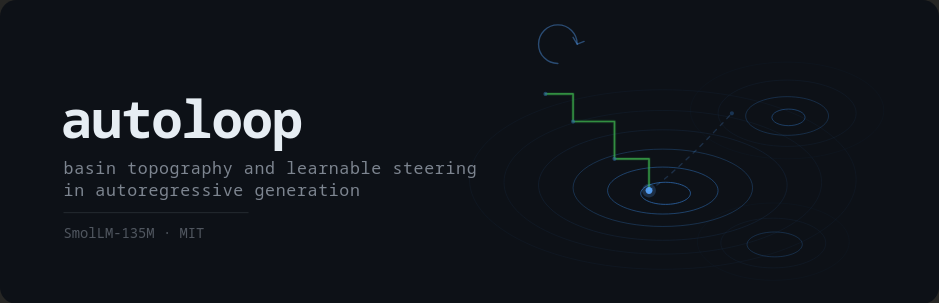
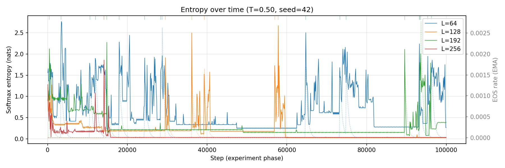

<p align="center">
  <picture>
    <source media="(prefers-color-scheme: dark)" srcset="static/banner.svg">
    <source media="(prefers-color-scheme: light)" srcset="static/banner.svg">
    
  </picture>
</p>

<p align="center">
  <em>A small language model generates tokens into a fixed-length sliding window, conditioning entirely on its own output.<br>No input, no prompt, no external signal — just a model consuming its own predictions forever.</em>
</p>

---

The resulting system is a discrete stochastic dynamical system with surprisingly rich structure.

> **Status:** Active research. Landscape mapping and closed-loop control complete. Currently building basin cartography — systematic discovery and clustering of attractor basins across the parameter space. Not taking contributions, but forks and discussion welcome.

> **On scope and scaling.** This work studies a 135M parameter model on a single GPU. The dynamics described — attractor basins, escape hysteresis, steerable control — are empirical observations at this scale. The methods are model-agnostic; the survey protocol, control loop, and basin fingerprinting make no assumptions about model size or capability. Whether these phenomena persist, intensify, or qualitatively change at scale is an open question with implications for the robustness of any system where a model conditions on its own output. This framework makes model behavior more legible. We believe legibility serves safety more than it serves misuse, because defenders need to understand the full landscape while attackers only need to find one path. But we acknowledge that systematic basin mapping at scale could surface unexpected dynamics, and we encourage the community to develop these tools in the open rather than behind closed doors — which is why this repo is public.

## What happens

Turn the temperature down and the model falls into attractor basins — repetitive loops it can't escape. But these aren't random. Every attractor features content that describes its own dynamics: tautologies ("the generator is a generator"), incomplete predicates ("was a time where"), self-perpetuating conditions ("not getting enough sleep... can include not getting enough sleep"), and confinement ("the man was not allowed to leave"). These are eigenstates — configurations where content, structure, and prediction align into zero-gradient fixed points.

Collapse isn't binary. It's a staircase: the model descends through a hierarchy of basins, each with a distinct entropy floor. Context length (L) sets the speed of descent.



At threshold temperature, the model doesn't jump out of a basin — it tunnels out by mutating the attractor's content. "Star Wars" becomes "Star Wars 2000" becomes "Star Wars: The Old Republic" becomes freedom. Period-doubling as a route to chaos. Once escaped, it never returns.

A simple closed-loop controller can navigate this landscape, holding the system at the edge between collapse and rich dynamics. Temperature and context length are coupled actuators; Heaps' beta (vocabulary growth rate) is the control signal. The system finds a natural equilibrium at beta ~ 0.90 regardless of starting conditions.

## What we're mapping

Four regimes emerge across temperature (T) and context length (L): repetitive collapse, suppressed dynamics, rich dynamics, and incoherent noise. The boundary between collapse and escape is sharp, L-dependent, and hysteretic — exiting an occupied basin requires ~0.4T more than avoiding it from a cold start.

The current work is basin cartography: a survey protocol that systematically cools to capture basins, fingerprints them via compression spectra and embeddings, heats to escape, and repeats. Early results at L=8 show a long tail of basin types — 17 discovered across 3 seeds with no sign of saturation. Small perturbations consistently deepen basins; large perturbations reset to the top of the hierarchy.

The longer-term goal is a map of the model's behavioral repertoire: which basins exist, how they connect, what the transition costs are, and whether a learned controller can navigate the full topology.

See [observations.md](observations.md) for the full findings log with reproduction commands, and [docs/](docs/) for design documents.

## Quick start

```bash
uv sync                                    # install
loop run fixed --seed 42 -L 64 -T 0.50 --total-steps 100000   # run an experiment
loop survey --seed 42 -L 8 --total-steps 100000                # basin survey
loop index build && loop index query        # browse the catalogue
loop explore                                # interactive web explorer
loop grep "Star Wars" --type sweep --count  # search generated text
```

Requires SmolLM-135M weights at `data/model/SmolLM-135M/`. See `loop --help` for full CLI reference.

## Project documents

- [observations.md](observations.md) — Findings log with current model summary
- [docs/project-brief.md](docs/project-brief.md) — Full research design
- [docs/basin-mapping.md](docs/basin-mapping.md) — Basin survey protocol and roadmap
- [docs/basin-clustering-plan.md](docs/basin-clustering-plan.md) — Clustering and tooling plan
- [docs/interaction-topology.md](docs/interaction-topology.md) — Speculative framing: generative dynamics as interaction paradigm

## License

[MIT](LICENSE)
