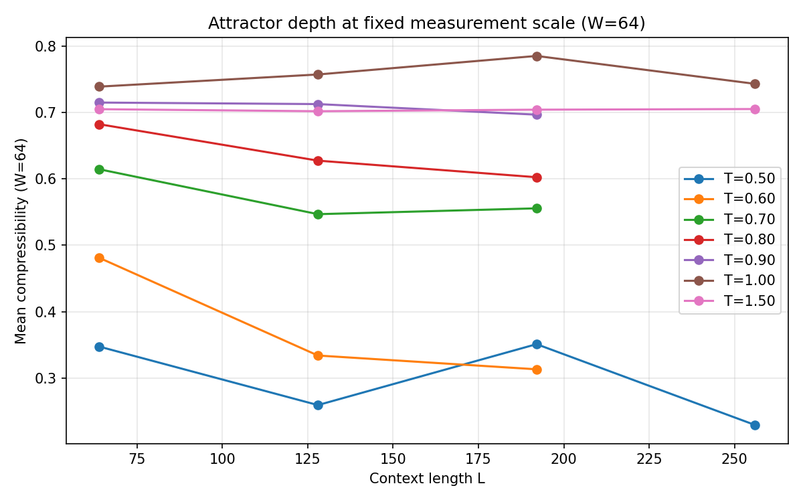

# autoloop

Multi-scale complexity control in closed-loop autoregressive generation.

A small language model (SmolLM-135M) generates tokens indefinitely into a fixed-length sliding context window, conditioning entirely on its own output. The resulting system is a discrete stochastic dynamical system — and it has surprisingly rich structure.

This project systematically maps the dynamical landscape across temperature (T) and context length (L), develops multi-scale compression as a diagnostic framework, and works toward closed-loop complexity control.

> **Status:** Active research, very early. Phase 0 pilot data collection and analysis. Under very active development — expect breaking changes. Not currently taking contributions, but forks and discussion are always welcome.

## What we're finding

**Three regimes** emerge at any fixed context length: repetitive collapse (low T), rich structured dynamics (mid T), and incoherent noise (high T). The crossover between collapse and rich dynamics is sharp and occurs around T=0.70-0.80 for SmolLM-135M.

**Temperature and context length are orthogonal actuators.** T controls the per-step noise floor. L controls memory depth and attractor stickiness. At T=0.50, L=64 shows persistent escape episodes from collapse attractors while L=256 locks in permanently. At T=1.00, longer context shifts the operating point without causing collapse.

**Collapse is a staircase, not a binary.** At T=0.50, each context length settles onto a distinct entropy floor. L=256 hits the true zero-entropy floor by ~15k steps. L=128 sits on a meta-stable false floor for ~45k steps before dropping. L=64 stays on a higher basin for the full 100k-step run. Collapse appears to be a timescale phenomenon — L sets how fast you descend through a hierarchy of attractor basins.


**Measurement window size (W) is a third dimension.** Gzip compressibility depends strongly on the window over which it's computed. We use a standard grid of W values ({16, 32, 64, 128, 256}) to probe structure at multiple scales simultaneously. At low T, the L-curves separate dramatically across W scales. At T >= 0.90, L barely matters at any W.



**EOS signal meaning is regime-dependent.** At T=1.00 (rich dynamics), EOS tokens fire from the interior of the phase-space cloud — the model tries to end during its richest dynamics. At T=0.50 (collapse), EOS fires during escape attempts from attractors. Same signal, different meaning depending on regime.


See [observations.md](observations.md) for the full findings log with reproduction commands.

## Architecture

Scripts, not a package. Flat layout.

| Script | Purpose |
|--------|---------|
| `generate.py` | Core generation loop with checkpoint/resume |
| `analyze.py` | Post-hoc analysis: sliding-window gzip compressibility, stationarity |
| `plot.py` | Visualization: entropy time series, compressibility, phase portraits, violins |
| `analyze_windows.py` | Recompute analysis at standard W grid |
| `plot_window_scaling.py` | Window scaling exploration plots |
| `pilot_sweep.py` | Batch runner for pilot grid |
| `seed_sweep.py` | Batch runner for seed replication |
| `explorer.py` | Interactive web explorer (FastAPI backend) |
| `static/index.html` | Explorer frontend (Plotly.js) |

## Data

24 completed runs (seed=42): L={64, 128, 192, 256} x T={0.50, 0.60, 0.70, 0.80, 0.90, 1.00, 1.50}. Seed replication (seeds 123, 7) in progress.

Each run: 100,000 tokens of pure autoregressive generation on a GTX 1070. Per-token entropy, log-probability, EOS flag, and decoded text stored in Parquet files. Gzip compressibility computed post-hoc at multiple window sizes.

Raw data is not included in the repo (too large). Figures are tracked in `data/figures/`. Run the generation and analysis scripts to reproduce from scratch, or see [run-index.md](run-index.md) for the full grid status.

## Quick start

```bash
# Dependencies (uv)
uv sync

# Single generation run
python generate.py --context-length 64 --temperature 1.0 --seed 42 \
  --num-tokens 100000 --model-dir data/model/SmolLM-135M \
  --output-dir data/runs --device cuda

# Analysis at standard window sizes
python analyze_windows.py

# Interactive explorer
uvicorn explorer:app --reload --port 8000

# Plots
python plot.py --runs data/runs/L0064_T*_S42.parquet
python plot_window_scaling.py

# Reproduce all standard figures
python reproduce_plots.py
```

Requires a local copy of SmolLM-135M weights at `data/model/SmolLM-135M/`.

## Project documents

- [observations.md](observations.md) — Findings log with current model summary
- [run-index.md](run-index.md) — Grid status, phase planning
- [docs/project-brief.md](docs/project-brief.md) — Full research design
- [docs/explorer-wireframes.md](docs/explorer-wireframes.md) — Explorer layout design (right drawer recommendation)
- [docs/interaction-topology.md](docs/interaction-topology.md) — Speculative framing: generative dynamics as interaction paradigm

## Where this is headed

**Phase 0 (current):** Map the T x L landscape. Identify regimes, transitions, and anomalies. Build instrumentation.

**Phase 1:** Fixed-temperature characterization. Transfer functions. Multi-scale compression analysis. Complete the phase map.

**Phase 2:** Temperature and context-length ramps. Hysteresis tests. Path dependence.

**Phase 3:** Closed-loop control. Joint T+L controller using multi-scale compression feedback. Target: sustain the system in the structured-dynamics regime indefinitely.

The longer-term question: what if the dynamical structure we're mapping here — phase spaces, attractor basins, measurement scales — is the right vocabulary for thinking about AI interaction in general? See [docs/interaction-topology.md](docs/interaction-topology.md) for early thinking on this.

## License

[MIT](LICENSE)
